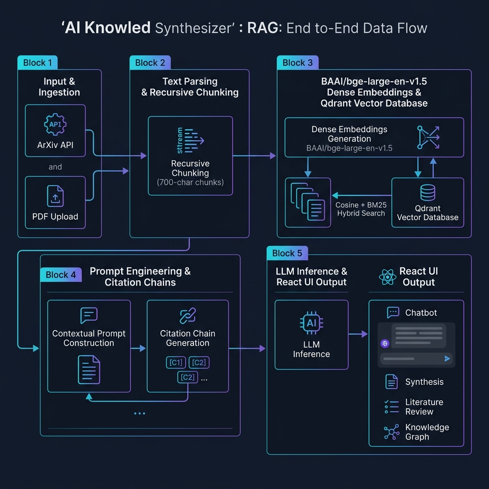
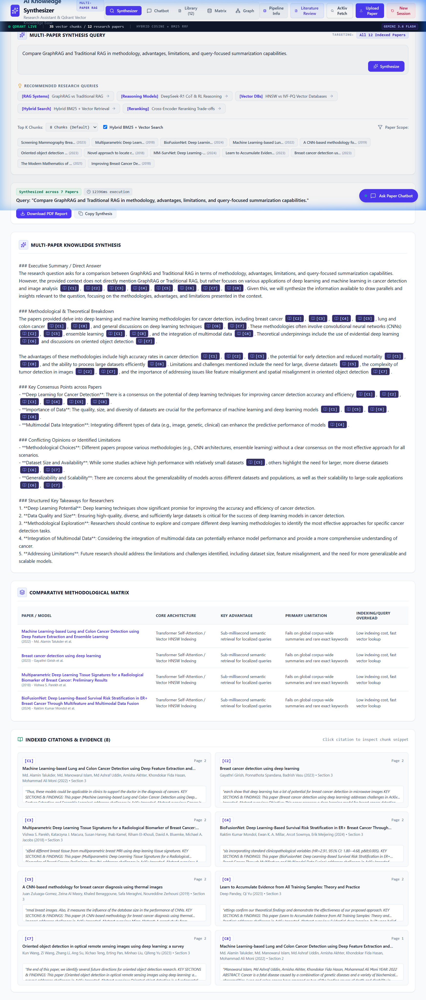
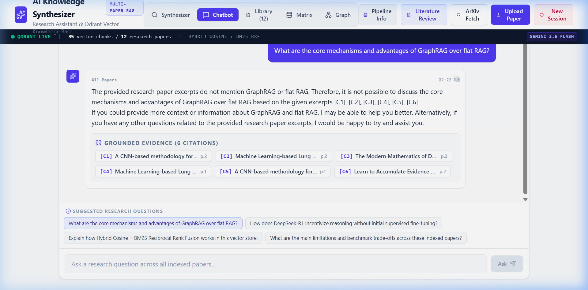
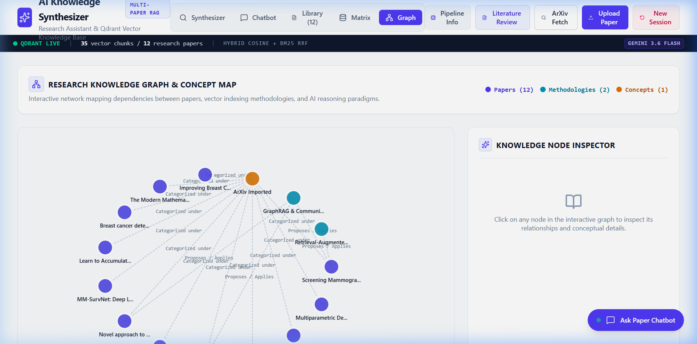
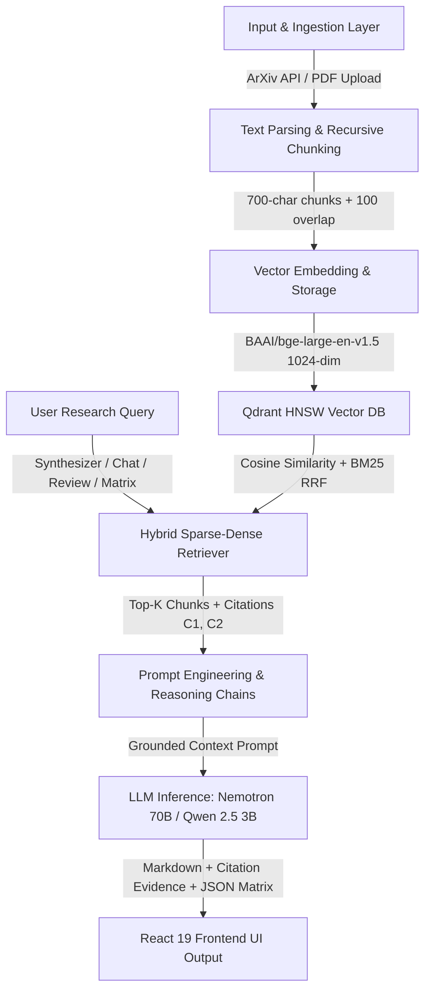

# AI Multi-Paper Knowledge Synthesizer 📚⚡


A full-stack, production-grade research paper knowledge synthesis engine powered by **Python (FastAPI + Hugging Face)**, **Node.js Express**, **Nvidia Nemotron LLM / Local Qwen 2.5**, **BAAI/bge-large-en-v1.5 1024-dim Vector Embeddings**, **Qdrant Vector Database**, and a **React 19 (TypeScript + Vite 6 + Tailwind CSS v4)** frontend.

The platform enables researchers and developers to query across multiple indexed AI manuscripts, execute dense vector retrieval using **BAAI/bge-large-en-v1.5** embeddings and cosine similarity search, generate multi-paper synthesis reports with verifiable inline citations `[C1]`, `[C2]`, produce publication-ready literature reviews, interact with an AI research paper chatbot, and explore comparative methodological matrices & dynamic knowledge graph networks.

---

## 🖼️ Application Showcase & Architecture Diagram

### System Data Flow Architecture


### 1. Multi-Paper RAG Synthesis Workspace


### 2. Nvidia Nemotron AI Research Chatbot


### 3. Dynamic Knowledge Graph Network


> 📄 **Technical Specification PDF**: Download the complete system architecture and data flow PDF:  
> [AI_Knowledge_Synthesizer_System_Architecture_and_Flow.pdf](file:///d:/projects%202026/RAG/ai-knowledge-synthesizer%20%281%29/AI_Knowledge_Synthesizer_System_Architecture_and_Flow.pdf)

---

## 🔄 End-to-End System Data Flow Pipeline



### Pipeline Step Breakdown:

1. **Input & Ingestion Layer**:
   - **ArXiv Live Importer**: Fetches paper metadata, abstracts, and official PDF download links (`https://arxiv.org/pdf/<arxiv_id>.pdf`) from official ArXiv XML API (`https://export.arxiv.org/api/query`).
   - **Custom PDF/Text Upload**: Parses raw buffer text from user-uploaded PDFs using `pdf-parse` (Node) / `pypdf` (Python).

2. **Text Parsing & Recursive Chunking**:
   - **Recursive Character Splitter**: Splits manuscript text hierarchically using `["\n\n", "\n", ". ", " "]`.
   - **Chunk Size**: 700 characters | **Chunk Overlap**: 100 characters *(ensures context continuity)*.
   - **Metadata Payload**: Each chunk is attached to JSON metadata: `paperId`, `paperTitle`, `authors`, `year`, `sectionName`, `chunkIndex`, `pageNumber`.

3. **BAAI/bge-large-en-v1.5 Embeddings & Qdrant Storage**:
   - **Dense Embeddings**: Generates **1024-dimensional dense float vector embeddings** using Hugging Face model `BAAI/bge-large-en-v1.5`.
   - **Qdrant Vector Database**: Stores vector points inside Qdrant HNSW Graph Index (`Distance.COSINE`).

4. **Hybrid Sparse-Dense Retrieval Engine (Cosine + BM25)**:
   - Combines 1024-dim dense vector cosine similarity with BM25 term-frequency keyword matching:
     $$\text{Hybrid Retrieval Score} = 0.65 \times \text{CosineSimilarity}(\vec{q}, \vec{d}) + 0.35 \times \text{BM25Score}(q, d)$$
   - Maps top-K chunks into evidence blocks tagged with verifiable inline citations `[C1]`, `[C2]`, `[C3]`.

5. **LLM Inference & Reasoning Chains**:
   - **Cloud API Mode**: Invokes Nvidia Nemotron 70B (`nvidia/Llama-3.1-Nemotron-70B-Instruct-HF` / `meta-llama/Llama-3.3-70B-Instruct`) via Hugging Face Router API.
   - **Local Mode**: Runs `qwen2.5:3b` locally via [Ollama](https://ollama.com) on `http://localhost:11434`.
   - **Offline Fallback Engine**: Built-in 0ms local RAG reasoning engine grounded in exact paper paragraphs.

6. **React 19 Frontend UI Output**:
   - Renders Markdown synthesis with clickable inline citations `[C1]` that trigger the **Citation Modal**.
   - Renders dynamic SVG Knowledge Graph networks mapped to active session papers.
   - Client-side exporter generates formatted PDF reports using `jsPDF`.

---

## 📂 Project Directory Structure

```
├── assets/                         # System architecture diagram & UI screenshots
│   ├── project_architecture_flow.png
│   ├── synthesizer_workspace.png
│   ├── research_chatbot.png
│   └── knowledge_graph.png
│
├── backend/                        # Python FastAPI Backend Engine
│   ├── chains/                     # Synthesis & Reasoning Chains
│   │   ├── rag_synthesis.py        # Multi-paper RAG synthesis via Nemotron
│   │   ├── literature_review.py    # Automated literature review chain
│   │   └── comparison_matrix.py    # Dynamic JSON matrix generation chain
│   ├── routers/                    # FastAPI APIRouter Endpoints
│   │   ├── arxiv.py                # ArXiv search & live paper import (/api/arxiv/*)
│   │   ├── rag.py                  # RAG search, synthesis, review & matrix (/api/rag/*)
│   │   ├── papers.py               # Paper collection management & PDF upload (/api/papers/*)
│   │   └── knowledge.py            # Multi-turn chatbot & Knowledge Graph (/api/chat)
│   ├── services/                   # Backend Logic Services
│   │   ├── nemotron_llm.py         # Nvidia Nemotron LLM inference service (Hugging Face API)
│   │   ├── vector_store.py         # BAAI/bge-large-en-v1.5 vector store & Qdrant HNSW
│   │   └── arxiv_service.py        # Live ArXiv XML API fetcher & parser
│   ├── main.py                     # FastAPI entrypoint (Port 8000)
│   ├── requirements.txt            # Python dependencies
│   └── .env.example                # Backend environment template
│
├── src/                            # React 19 Frontend & Express Server
│   ├── components/                 # UI React Components
│   │   ├── SynthesisWorkspace.tsx       # Query input & preset prompt bar
│   │   ├── SynthesizedResponseView.tsx  # RAG report renderer with inline citations
│   │   ├── ResearchChatbot.tsx          # Multi-turn paper Q&A assistant
│   │   ├── PaperLibrary.tsx             # Paper collection & raw vector chunk inspector
│   │   ├── NewSessionModal.tsx          # Session reset / benchmark paper loader
│   │   ├── ArXivImporterModal.tsx       # Live ArXiv paper search & importer modal
│   │   ├── PdfUploadModal.tsx           # Custom PDF / text file uploader
│   │   ├── LiteratureReviewView.tsx     # Automated literature review generator
│   │   ├── ComparisonMatrixView.tsx     # Methodological matrix comparison grid
│   │   └── KnowledgeGraphView.tsx       # Dynamic SVG network graph canvas
│   ├── server/                     # Express Node.js Server Architecture
│   │   ├── controllers/            # Controller logic (chat, rag, arxiv, graph)
│   │   ├── models/                 # BAAI/bge-large-en-v1.5 vector store & paper database
│   │   ├── routes/                 # Express MVC routes (/api/*)
│   │   └── services/               # Nemotron & Hugging Face LLM service
│   ├── services/                   # Frontend API Client (safeFetch wrapper)
│   │   └── api.ts
│   ├── App.tsx                     # Main layout, tab navigation, & state orchestration
│   ├── main.tsx                    # React application entrypoint
│   └── index.css                   # Tailwind CSS v4 setup & global styles
│
├── .env.example                    # Root environment configuration template
├── AI_Knowledge_Synthesizer_System_Architecture_and_Flow.pdf # PDF Specification
├── package.json                    # Node dependencies & dev scripts
├── server.ts                       # Express + Vite server entrypoint (Port 3000)
├── tsconfig.json                   # TypeScript configuration
└── vite.config.ts                  # Vite 6 configuration
```

---

## 🛠️ Tech Stack & Framework Specifications

| Tier | Component / Framework | Details & Purpose |
| :--- | :--- | :--- |
| **Frontend UI** | **React 19 & TypeScript** | Modern component state orchestration & full type safety |
| **Build Tooling** | **Vite 6** | Instant HMR development server & production bundling |
| **Styling** | **Tailwind CSS v4** | Utility-first glassmorphism styling & dark-mode aesthetics |
| **Icons & Motion** | **Lucide React & Framer Motion** | Modern scientific icon set & fluid micro-animations |
| **Node API Server** | **Express.js (Node.js)** | Express MVC API controllers & Vite middleware hosting (`Port 3000`) |
| **Python Backend** | **FastAPI & Uvicorn** | Asynchronous OpenAPI engine with Swagger documentation (`Port 8000`) |
| **Dense Embeddings** | **`BAAI/bge-large-en-v1.5`** | 1024-dimensional dense float vector embeddings |
| **Vector Database** | **Qdrant Vector DB** | HNSW Graph Index with Cosine Distance & Payload Filtering |
| **Cloud LLM Engine** | **Nvidia Nemotron 70B** | `nvidia/Llama-3.1-Nemotron-70B-Instruct-HF` via Hugging Face Router API |
| **Local LLM Engine** | **Qwen 2.5 3B** | `qwen2.5:3b` via [Ollama](https://ollama.com) (`Port 11434`) |
| **PDF Exporter** | **jsPDF** | Client-side publication-ready PDF report generation |

---

## 🔑 Environment Variables Reference

Copy `.env.example` to `.env` in the root directory:

```env
# Hugging Face Access Token: Required for Nvidia Nemotron LLM & BAAI/bge-large-en-v1.5 embeddings
HF_TOKEN=your_hf_token_here
HUGGINGFACEHUB_API_TOKEN=your_hf_token_here

# LLM & Embedding Models
NEMOTRON_MODEL=nvidia/Llama-3.1-Nemotron-70B-Instruct-HF
EMBEDDING_MODEL=BAAI/bge-large-en-v1.5

# Web Server & Client Ports
VITE_API_BASE_URL=
PORT=3000
NODE_ENV=development
APP_URL=http://localhost:3000

# Optional External Qdrant Vector DB (Leave empty for In-Memory Qdrant Collection)
QDRANT_URL=
QDRANT_API_KEY=
```

### Environment Variable Specification Table:

| Variable Name | Description | Default Value | Required |
| :--- | :--- | :--- | :--- |
| `HF_TOKEN` | Hugging Face Access Token for Nemotron & BAAI embeddings | `your_hf_token_here` | **Yes** |
| `NEMOTRON_MODEL` | Hugging Face Nemotron LLM Repository ID | `nvidia/Llama-3.1-Nemotron-70B-Instruct-HF` | **Yes** |
| `EMBEDDING_MODEL` | Hugging Face Embedding Model Repository ID | `BAAI/bge-large-en-v1.5` | **Yes** |
| `VITE_API_BASE_URL` | Base URL for API calls (Leave blank for relative `/api`) | `""` | No |
| `PORT` | Express Web Server Port | `3000` | No |
| `NODE_ENV` | Environment mode (`development` \| `production`) | `development` | No |
| `QDRANT_URL` | Optional external Qdrant Vector DB URL | `""` (In-Memory) | No |

---

## 💻 Hardware & Local Execution Specifications

For offline execution without Hugging Face API rate limits, the platform supports local model execution via **Ollama**.

### System Hardware Benchmarks : 

| Model Name | Model Size | RAM Footprint | Token Generation Speed | Recommended Status |
| :--- | :--- | :--- | :--- | :--- |
| ⭐ **`qwen2.5:3b`** | 1.9 GB | ~2.2 GB RAM | **~20 tokens/sec** | **PERFECT MATCH** (Best overall balance) |
| ⭐ **`llama3.2` (3B)** | 2.0 GB | ~2.3 GB RAM | **~18 tokens/sec** | **EXCELLENT** (Great natural prose) |
| ⚡ **`deepseek-r1:1.5b`** | 1.1 GB | ~1.3 GB RAM | **~35 tokens/sec** | **LIGHTWEIGHT** (Fast reasoning) |
| ⚠️ **`qwen2.5:7b`** | 4.7 GB | ~5.2 GB RAM | ~5 to 7 tokens/sec | *Borderline* (Usable, tighter RAM) |

---

## 🚀 Step-by-Step Quick Start Guide

### Step 1: Clone Repository & Install Dependencies

```bash
git clone https://github.com/deeppawarofficial-sudo/PY_KNL_SYS.git
cd PY_KNL_SYS
npm install
```

### Step 2: Configure Environment File

```bash
cp .env.example .env
```
*(Paste your Hugging Face Token into `HF_TOKEN` inside `.env`)*

### Step 3: Launch Node Express + React Frontend

```bash
npm run dev
```
- Open your browser at **`http://localhost:3000`**

### Step 4: (Optional) Run Python FastAPI Backend

```bash
cd backend
python3 -m venv venv
source venv/bin/activate    # On Windows: venv\Scripts\activate
pip install -r requirements.txt
python main.py
```
- Interactive FastAPI Swagger Docs: **`http://localhost:8000/docs`**

### Step 5: (Optional) Run Local Model via Ollama

```bash
# Install Ollama from https://ollama.com/download
ollama run qwen2.5:3b
```

---

## 📄 License & Credits

MIT License. Built for AI research exploration, multi-paper RAG synthesis, and knowledge extraction.
