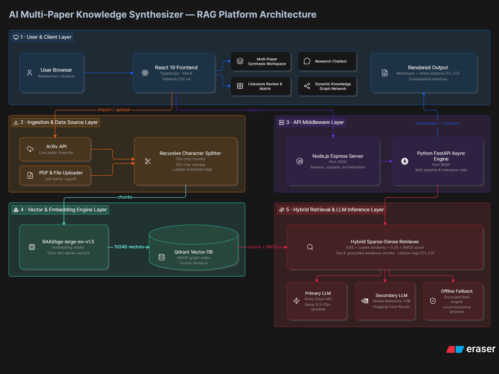
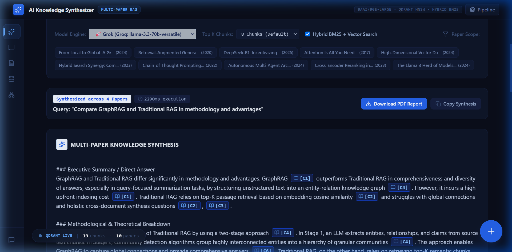
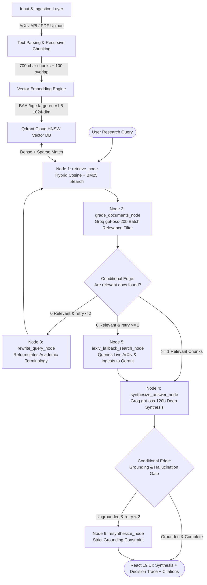

# AI Multi-Paper Knowledge Synthesizer 📚⚡


-green?style=flat-square)


A full-stack, production-grade research paper knowledge synthesis engine powered by **LangGraph Corrective RAG (CRAG)**, **Python (FastAPI + LangChain)**, **Node.js Express**, **Groq Cloud (`openai/gpt-oss-120b` + `openai/gpt-oss-20b`)**, **BAAI/bge-large-en-v1.5 1024-dim Vector Embeddings**, **Qdrant Vector Database**, and a **React 19 (TypeScript + Vite 6 + Tailwind CSS v4)** frontend.

The platform enables researchers and developers to query across multiple indexed AI manuscripts, execute dense vector retrieval using **BAAI/bge-large-en-v1.5** embeddings and hybrid cosine + BM25 similarity search, run self-corrective relevance grading and query rewriting via **LangGraph**, generate multi-paper synthesis reports with verifiable inline citations `[C1]`, `[C2]`, produce publication-ready literature reviews, interact with an AI research chatbot, and explore comparative methodological matrices & dynamic knowledge graph networks.

---

## 🏗️ System Architecture



---

## 🖼️ Application Screenshots

### 1. Multi-Paper RAG Synthesis Workspace


### 2. Multi-Paper Knowledge Synthesis Result


### 3. AI Research Paper Chatbot


### 4. Dynamic Knowledge Graph Network


---

## 🔄 End-to-End System Data Flow Pipeline



### Pipeline Step Breakdown:

1. **Input & Ingestion Layer**:
   - **ArXiv Live Importer**: Fetches paper metadata, abstracts, and official PDF download links from the ArXiv XML API (`https://export.arxiv.org/api/query`).
   - **Custom PDF/Text Upload**: Parses raw buffer text from user-uploaded PDFs using `pdf-parse` (Node) / `pypdf` (Python).

2. **Text Parsing & Recursive Chunking**:
   - **Recursive Character Splitter**: Splits manuscript text hierarchically using `["\n\n", "\n", ". ", " "]`.
   - **Chunk Size**: 700 characters | **Chunk Overlap**: 100 characters *(ensures context continuity)*.
   - **Metadata Payload**: Each chunk is attached to JSON metadata: `paperId`, `paperTitle`, `authors`, `year`, `sectionName`, `chunkIndex`, `pageNumber`.

3. **BAAI/bge-large-en-v1.5 Embeddings & Qdrant Cloud Storage**:
   - **Dense Embeddings**: Generates **1024-dimensional dense float vector embeddings** using Hugging Face model `BAAI/bge-large-en-v1.5`.
   - **Qdrant Vector Database**: Stores vector points inside Qdrant HNSW Graph Index (`Distance.COSINE`) hosted on AWS cloud.

4. **Hybrid Sparse-Dense Retrieval (Cosine + BM25)**:
   - Combines 1024-dim dense vector cosine similarity with BM25 term-frequency keyword matching:
     $$\text{Hybrid Score} = 0.65 \times \text{CosineSimilarity}(\vec{q}, \vec{d}) + 0.35 \times \text{BM25Score}(q, d)$$
   - Maps candidate chunks into evidence blocks tagged with verifiable inline citations `[C1]`, `[C2]`, `[C3]`.

5. **LangGraph Corrective RAG (CRAG) Orchestration**:
   - **Document Relevance Grader (`openai/gpt-oss-20b`)**: Evaluates retrieved chunks in batch to eliminate off-topic noise before generation.
   - **Query Reformulation Loop**: If no relevant chunks are found, reformulates the search terms into academic keywords and retries retrieval.
   - **Live ArXiv Fallback**: If local papers lack coverage, queries ArXiv API, auto-ingests new papers into Qdrant Cloud, and continues execution.
   - **Deep Academic Synthesis (`openai/gpt-oss-120b`)**: Synthesizes structured research markdown with verifiable inline citations.
   - **Grounding & Hallucination Check**: Evaluates entailment against source excerpts; regenerates with strict constraints if unsupported claims occur.

6. **React 19 Frontend UI & Decision Trace**:
   - **Interactive LangGraph Decision Trace**: Collapsible UI widget visualizing step-by-step nodes executed (`[Retrieve]`, `[Grade]`, `[Rewrite]`, `[ArXiv Fallback]`, `[Synthesize]`).
   - Renders Markdown synthesis with clickable inline citations `[C1]` that trigger the **Citation Modal**.
   - **Floating SpeedDial FAB** (bottom-right) for Upload PDF, ArXiv Fetch, Literature Review, New Session.
   - **Floating Live Stats Widget** (bottom-left) showing live Qdrant chunk & paper count.
   - Dynamic SVG Knowledge Graph networks mapped to active session papers.
   - Client-side PDF report exporter using `jsPDF`.


---

## 📂 Project Directory Structure

```
├── assets/                         # Screenshots & architecture diagrams
│   ├── synthesizer_workspace.png
│   ├── synthesis_result.png
│   ├── research_chatbot.png
│   └── knowledge_graph.png
│
├── backend/                        # Python FastAPI Backend Engine
│   ├── chains/                     # Synthesis & Reasoning Chains
│   │   ├── rag_synthesis.py        # Multi-paper RAG synthesis via Nemotron
│   │   ├── literature_review.py    # Automated literature review chain
│   │   └── comparison_matrix.py    # Dynamic JSON matrix generation chain
│   ├── routers/                    # FastAPI APIRouter Endpoints
│   │   ├── arxiv.py                # ArXiv search & live paper import (/api/arxiv/*)
│   │   ├── rag.py                  # RAG search, synthesis, review & matrix (/api/rag/*)
│   │   ├── papers.py               # Paper collection management & PDF upload (/api/papers/*)
│   │   └── knowledge.py            # Multi-turn chatbot & Knowledge Graph (/api/chat)
│   ├── services/                   # Backend Logic Services
│   │   ├── nemotron_llm.py         # Nvidia Nemotron LLM inference service
│   │   ├── grok_llm.py             # Groq Cloud LLM inference service
│   │   ├── vector_store.py         # BAAI/bge-large-en-v1.5 vector store & Qdrant HNSW
│   │   └── arxiv_service.py        # Live ArXiv XML API fetcher & parser
│   ├── main.py                     # FastAPI entrypoint (Port 8000)
│   └── requirements.txt            # Python dependencies
│
├── src/                            # React 19 Frontend & Express Server
│   ├── components/                 # UI React Components
│   │   ├── SynthesisWorkspace.tsx       # Multi-paper RAG query input & preset bar
│   │   ├── SynthesizedResponseView.tsx  # RAG report renderer with inline citations
│   │   ├── ResearchChatbot.tsx          # Multi-turn paper Q&A assistant
│   │   ├── PaperLibrary.tsx             # Paper collection & vector chunk inspector
│   │   ├── ArXivImporterModal.tsx       # Live ArXiv paper search & importer modal
│   │   ├── PaperUploadModal.tsx         # Custom PDF / text file uploader
│   │   ├── LiteratureReviewModal.tsx    # Automated literature review generator
│   │   ├── ComparisonMatrixView.tsx     # Methodological matrix comparison grid
│   │   ├── KnowledgeGraphView.tsx       # Dynamic SVG network graph canvas
│   │   ├── Header.tsx                   # Slim top bar (logo + pipeline info)
│   │   ├── CitationInspectorModal.tsx   # Citation evidence inspector
│   │   ├── RAGArchitectureDrawer.tsx    # Pipeline architecture diagram drawer
│   │   └── NewSessionModal.tsx          # Session reset modal
│   ├── server/                     # Express Node.js Server Architecture
│   │   ├── controllers/            # Controller logic (chat, rag, arxiv, graph)
│   │   ├── models/                 # BAAI/bge-large-en-v1.5 vector store & paper database
│   │   ├── routes/                 # Express MVC routes (/api/*)
│   │   └── services/               # Groq & Nemotron LLM service (nemotronService.ts)
│   ├── services/                   # Frontend API Client (safeFetch wrapper)
│   │   └── api.ts
│   ├── App.tsx                     # Layout: sidebar nav, floating FAB, floating stats
│   ├── main.tsx                    # React application entrypoint
│   └── index.css                   # Tailwind CSS v4 + Midnight Blue @theme overrides
│
├── .env.example                    # Root environment configuration template
├── package.json                    # Node dependencies & dev scripts
├── server.ts                       # Express + Vite server entrypoint (Port 3000)
├── tsconfig.json                   # TypeScript configuration
└── vite.config.ts                  # Vite 6 configuration
```

---

## 🛠️ Tech Stack & Framework Specifications

| Tier | Component / Framework | Details & Purpose |
| :--- | :--- | :--- |
| **Frontend UI** | **React 19 & TypeScript** | Dark sidebar layout, floating components, interactive CRAG trace |
| **Build Tooling** | **Vite 6** | Instant HMR development server & production bundling |
| **Styling** | **Tailwind CSS v4** | Midnight Blue `@theme` palette override + utility-first dark mode |
| **Icons** | **Lucide React** | Modern scientific icon set |
| **Node API Server** | **Express.js (Node.js)** | Express MVC API controllers & Vite middleware hosting (`Port 3000`) |
| **Python Backend** | **FastAPI & Uvicorn** | Asynchronous OpenAPI engine with Swagger documentation (`Port 8000`) |
| **RAG Orchestrator**| **LangGraph (CRAG)** | Cyclic state graph with relevance grading, query rewrite & fallback |
| **Dense Embeddings** | **`BAAI/bge-large-en-v1.5`** | 1024-dimensional dense float vector embeddings |
| **Vector Database** | **Qdrant Vector DB** | AWS Cloud-hosted HNSW Graph Index with Cosine Distance |
| **Primary LLM** | **Groq Cloud API** | `openai/gpt-oss-120b` (synthesis) + `openai/gpt-oss-20b` (grading) |
| **Secondary LLM** | **Nvidia Nemotron 70B** | `nvidia/Llama-3.1-Nemotron-70B-Instruct-HF` via Hugging Face Router |
| **PDF Exporter** | **jsPDF** | Client-side publication-ready PDF report generation |

---

## 🔑 Environment Variables Reference

Copy `.env.example` to `.env` in the root directory:

```env
# Hugging Face Access Token: Required for Nvidia Nemotron LLM & BAAI/bge-large-en-v1.5 embeddings
HF_TOKEN=your_hf_token_here
HUGGINGFACEHUB_API_TOKEN=your_hf_token_here

# Groq Cloud API Key: Required for Grok LLM (primary model engine)
GROQ_API_KEY=your_groq_api_key_here

# LLM & Embedding Models
GROK_MODEL=openai/gpt-oss-120b
NEMOTRON_MODEL=nvidia/Llama-3.1-Nemotron-70B-Instruct-HF
EMBEDDING_MODEL=BAAI/bge-large-en-v1.5

# Web Server & Client Ports
PORT=3000
NODE_ENV=development
APP_URL=http://localhost:3000

# Qdrant Cloud Vector DB
QDRANT_URL=https://<your-cluster-id>.<region>.aws.cloud.qdrant.io
QDRANT_API_KEY=your_qdrant_api_key_here
QDRANT_COLLECTION_NAME=paper_chunks
```

### Environment Variable Reference:

| Variable | Description | Required |
| :--- | :--- | :--- |
| `HF_TOKEN` | Hugging Face token for Nemotron & BAAI embeddings | **Yes** |
| `GROQ_API_KEY` | Groq Cloud API key for primary synthesis & CRAG grader | **Yes** |
| `GROK_MODEL` | Primary Groq synthesis model (default: `openai/gpt-oss-120b`) | No |
| `NEMOTRON_MODEL` | Hugging Face Nemotron model repo ID | No |
| `EMBEDDING_MODEL` | Hugging Face embedding model repo ID | No |
| `PORT` | Express server port | No (default: 3000) |
| `QDRANT_URL` | Qdrant Cloud cluster endpoint | No |
| `QDRANT_API_KEY` | Qdrant Cloud API key | No |
| `QDRANT_COLLECTION_NAME` | Collection name for paper vectors (default: `paper_chunks`) | No |

---

## 🚀 Quick Start Guide

### Step 1: Clone & Install

```bash
git clone https://github.com/deeppawarofficial-sudo/PY_KNL_SYS.git
cd PY_KNL_SYS
npm install
```

### Step 2: Configure Environment

```bash
cp .env.example .env
# Fill in HF_TOKEN and GROQ_API_KEY
```

### Step 3: Launch Dev Server

```bash
npm run dev
```

Open **`http://localhost:3000`**

### Step 4: (Optional) Run Python FastAPI Backend

```bash
cd backend
python -m venv venv
venv\Scripts\activate   # Windows
pip install -r requirements.txt
python main.py
```

FastAPI Swagger Docs: **`http://localhost:8000/docs`**

---

## 🎨 UI Features

- **Dark Sidebar Navigation** — collapsible icon-only sidebar that expands to icon+label on hover
- **Floating SpeedDial FAB** — bottom-right `+` button expands into: Upload PDF, ArXiv Fetch, Literature Review, New Session
- **Floating Live Stats Widget** — bottom-left glassmorphism pill showing live Qdrant chunk & paper counts
- **Floating Research Chatbot** — accessible from sidebar Quick Chat button on any tab
- **Midnight Blue Theme** — custom `@theme` palette (`#0A0E1A` background, `#60A5FA` blue accent)
- **Citation Inspector Modal** — click any `[C1]` citation to view full paper evidence
- **PDF Report Export** — client-side jsPDF export of synthesis results

---

## 📄 License & Credits

MIT License. Built for AI research exploration, multi-paper RAG synthesis, and knowledge extraction.
